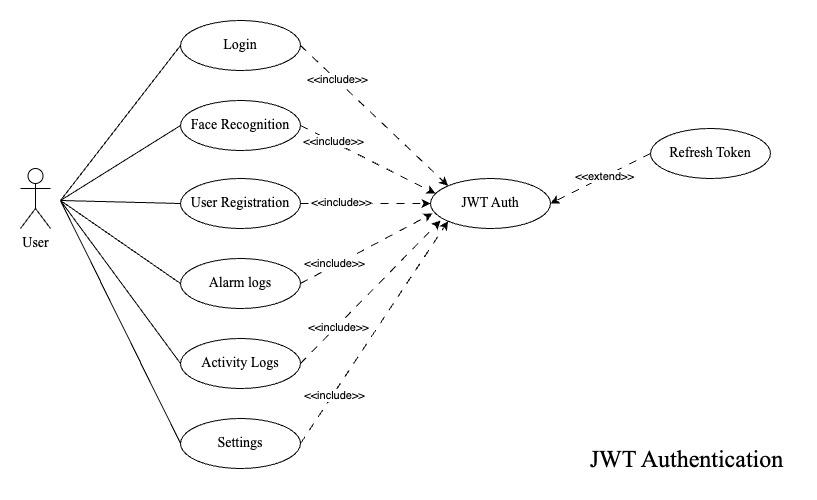
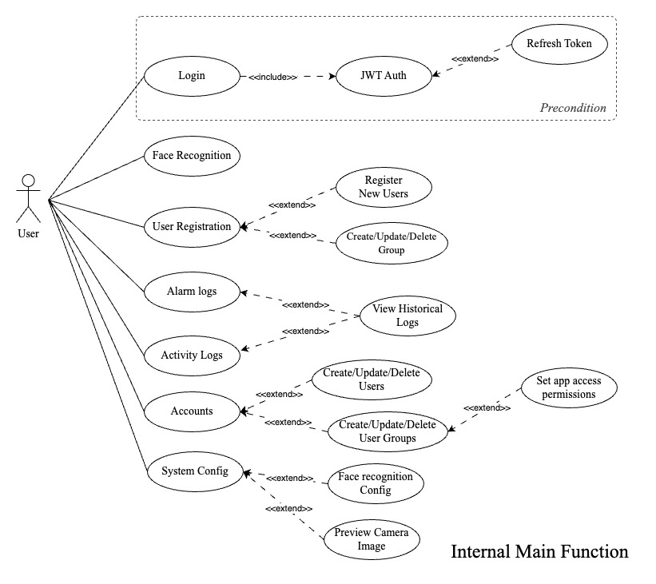
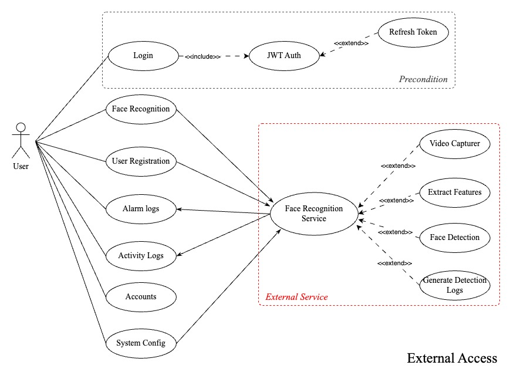
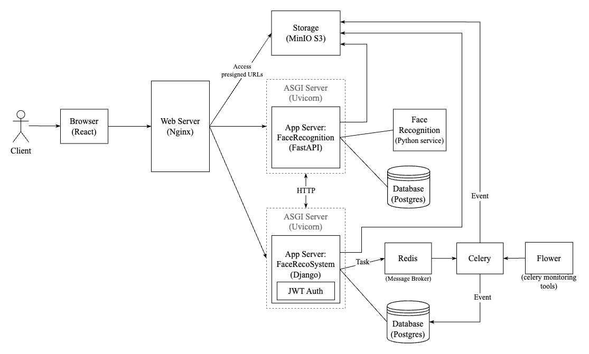
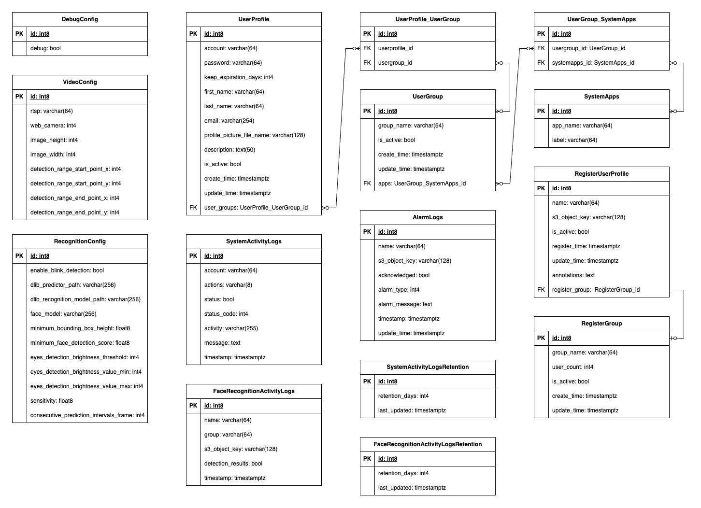
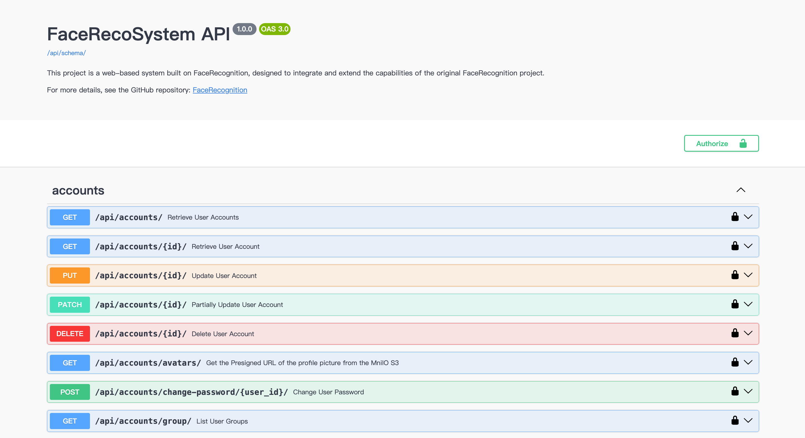
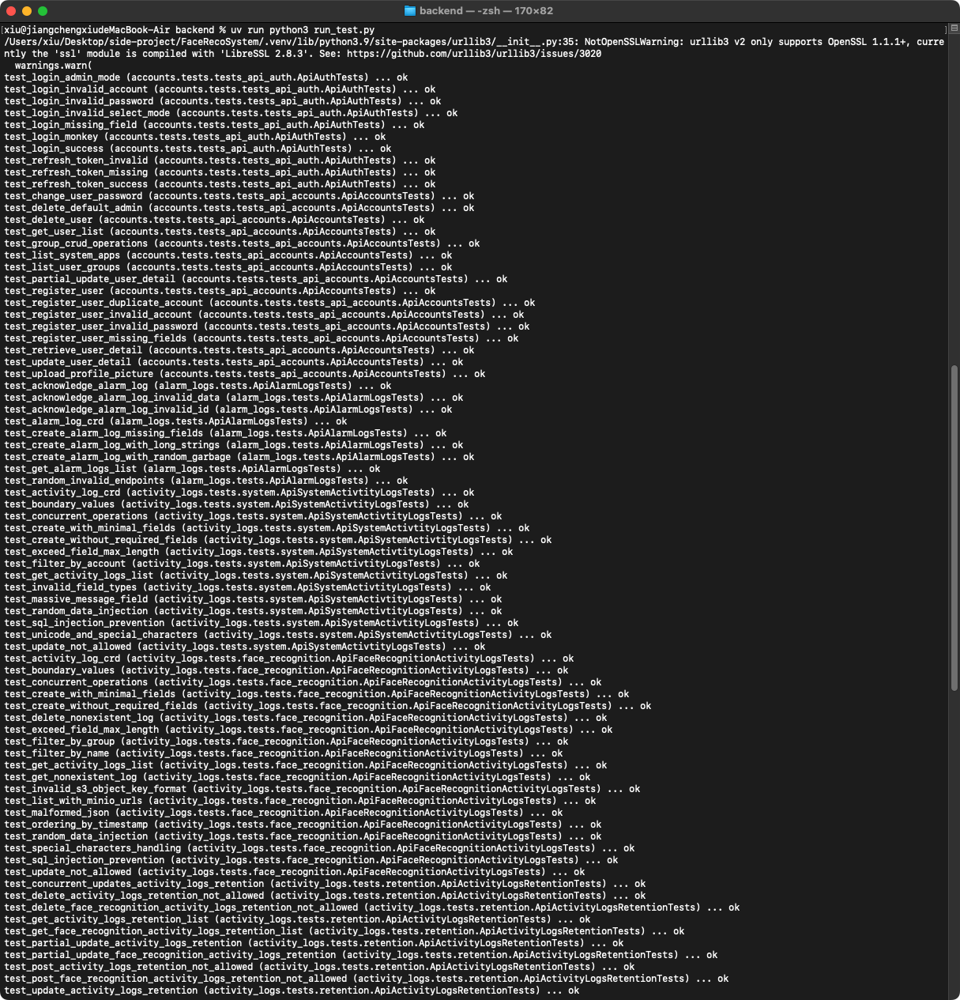
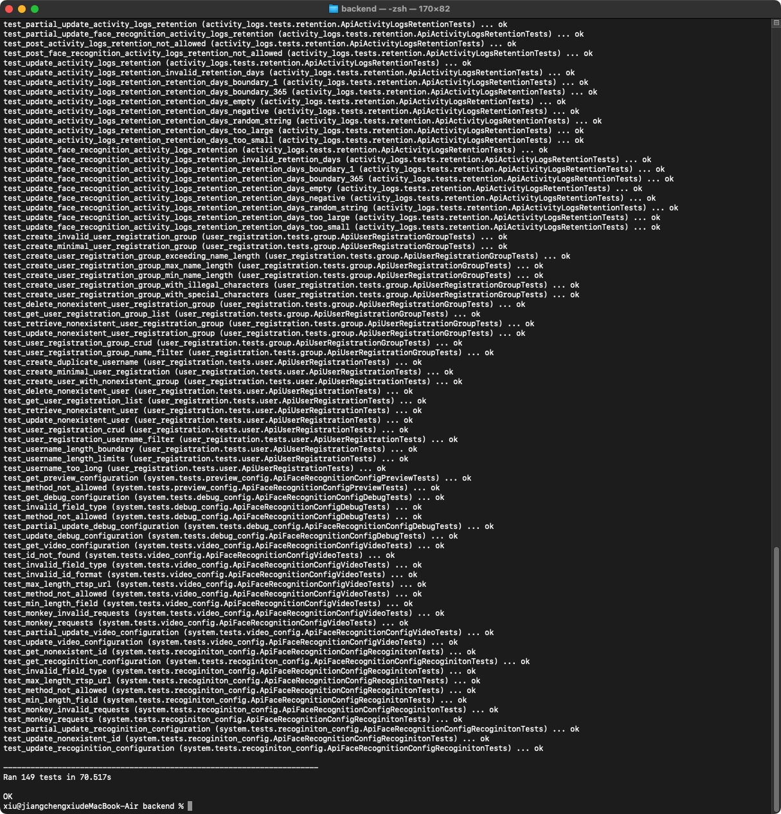

# Face Recognition System

<p align="center">
  <a href="https://www.python.org/downloads/release/python-3100/">
    
  </a>
  <a href="">
    
  </a>
  <a href="https://www.django-rest-framework.org/">
    
  </a>
  <a href="">
    
  </a>
  <a href="https://www.min.io/">
    
  </a>
  <a href="https://www.postgresql.org/">
    
  </a>

  <a href="">
    
  </a>
  <a href="">
    
  </a>
  <a href="">
  
  </a>
</p>

<p align="center">
Readme Languages: <a href="./README_en.md">English 🇺🇸</a> / <a href="./README.md">繁體中文版 🇹🇼</a>
</p>
<p align="center">
Development started, please see: <a href="./frontend/">Frontend </a> or  <a href="./backend/">Backend </a>
</a>


## Description

This system is a **Facial Recognition System** built with a front-end/back-end separated architecture.

The front-end (React) provides real-time video streaming, user interfaces, and various management pages. The back-end (Django) handles account and permission management, user face registration data, alarm logs, and API services. The facial recognition core is integrated with the [FaceRecognition](https://github.com/JiangXiu11200/FaceRecognition) service, using APIs and WebSocket to enable real-time video streaming, face detection, and feature extraction. The entire system is deployed locally using Docker.


## Features

#### Core Features：
- Login & Authentication: Uses JWT for identity and permission verification. Users are automatically assigned API access rights based on their group, ensuring data security and permission isolation.
- Real-time Video Streaming: Supports live video input (Webcam / IPCAM) and provides recognition information via WebSocket.
- Recognition Alarm Logs: Automatically records unauthorized face ROI images with timestamps for later review.
- Activity Logs: Divided into facial recognition logs and system logs. Facial recognition logs record successfully recognized faces, timestamps, and events, while system logs capture system operation activities.
- Recognition Parameter Settings: Administrators can adjust recognition box coordinates, thresholds, sensitivity, and other system parameters, as well as obtain real-time comparisons from the current video stream.

#### System Characteristics
- Front-end/Back-end Separation: Ensures maintainability and scalability.
- Asynchronous Tasks: Uses Celery to schedule periodic tasks, such as cleaning S3 temporary files and expired system logs.
- Containerized Deployment: Runs multiple services simultaneously via Docker Compose, with future CI/CD integration support.
- API Testing: Django unit tests cover positive, negative, boundary, and monkey testing to ensure system quality.


##  System Architecture

### Use Case

The system’s use case diagrams are divided into three separate diagrams based on functionality and focus, to clearly illustrate different aspects of business processes and system interactions:

#### JWT Authentication (JWTAuth) Use Case Diagram



- They describe the authentication process before and during user operations, including login and API permission checks.
- The purpose is to ensure system security and isolate user permissions.
- The system uses Refresh Tokens to periodically update Access Tokens, ensuring secure continuous access.

#### Main Function Use Case Diagram



- Describes the system’s core internal business processes, including user face registration, alarm/system log retrieval, system user management, and system parameter configuration.
- The purpose is to present the main business logic and clearly distinguish the flow and responsibilities of each function.

#### External Access Use Case Diagram



- Describes the interaction flow between the system and external services.
	- Face Recognition Service: Provides feature extraction and matching services, invoked by User Registration.
	- Alarm Logs / Activity Logs: Receive event data triggered by external services.
	- System Config: Updates configuration parameters of external services.
- The purpose is to illustrate external dependencies and system boundaries, facilitating API design and data flow.

### High-Level-Desgin



- The client accesses the Web Server, App Server, and S3 resources through an Nginx reverse proxy.
- Storage is used to store registered face images, face images from alarm/activity logs, and user profile pictures.
- App Server: FaceRecognition serves as the facial recognition core, deployed with FastAPI via Uvicorn. The browser connects to it via WebSocket for real-time streaming and communication. More details can be found at FaceRecognition.
- App Server: FaceRecoSystem is the main control system, deployed with Django via Uvicorn, providing JWT login and authentication workflows.
- Redis: Acts as the message broker for Celery, handling task scheduling and delivery.
- Celery: Executes periodic tasks for FaceRecoSystem, such as cleaning temporary S3 files and expired system logs in the database.
- Flower: Monitoring tool for Celery, accessible only within the internal network and used solely for observing Celery’s status.


### Database ER Diagram



The database section is categorized by function, as shown in the figure above. Specifically:

- UserProfile and UserGroup form a many-to-many relationship: a user can be assigned to one or more user groups, which determines the user’s application access permissions. If not assigned, the user has no access to any applications.
- UserGroup and SystemApps form a many-to-many relationship: a user group can have access to one or more applications.
- SystemActivityLogs: stores system activity logs.
- FaceRecognitionActivityLogs: stores facial recognition activity logs.
- AlarmLogs: stores alarm logs triggered when facial recognition fails.
- SystemActivityLogsRetention: defines the retention period for system activity logs.
- FaceRecognitionActivityLogsRetention: defines the retention period for facial recognition activity logs.
- DebugConfig, VideoConfig, RecognitionConfig: system parameters for the facial recognition service.


### Swagger API

Generate the API documentation using Swagger API.




- **Accounts**
  - GET /api/accounts/ - Retrieve User Accounts
  - GET /api/accounts/{id}/ - Retrieve User Account
  - PUT /api/accounts/{id}/ - Update User Account
  - PATCH /api/accounts/{id}/ - Partially Update User Account
  - DELETE /api/accounts/{id}/ - Delete User Account
  - GET /api/accounts/avatars/ - Get the Presigned URL of the profile picture from MinIO S3
  - POST /api/accounts/change-password/{user_id}/ - Change User Password
  - GET /api/accounts/group/ - List User Groups
  - POST /api/accounts/group/ - Create User Group
  - GET /api/accounts/group/{id}/ - Retrieve User Group
  - PUT /api/accounts/group/{id}/ - Update User Group
  - PATCH /api/accounts/group/{id}/ - Partially Update User Group
  - DELETE /api/accounts/group/{id}/ - Delete User Group by ID
  - POST /api/accounts/register/ - Register New User Account
  - GET /api/accounts/systemapps/ - List System Applications
  - POST /api/accounts/upload-profile-picture/ - Upload Profile Picture
- **Activity Logs**
  - GET /api/activity-logs/face-recognition/ - List facial recognition activity logs and obtain MinIO S3 face image Presigned URLs
  - POST /api/activity-logs/face-recognition/ - Create a new system activity log entry
  - GET /api/activity-logs/face-recognition/{id}/ - Retrieve a specific facial recognition activity log entry
  - DELETE /api/activity-logs/face-recognition/{id}/ - Delete a facial recognition activity log entry
  - GET /api/activity-logs/face-recognition/retention/ - Retrieve facial recognition activity logs retention settings
  - PUT /api/activity-logs/face-recognition/retention/{id}/ - Update facial recognition activity logs retention settings and reschedule cleanup task
  - PATCH /api/activity-logs/face-recognition/retention/{id}/ - Update facial recognition activity logs retention settings and reschedule cleanup task
  - GET /api/activity-logs/system/ - List system activity logs
  - POST /api/activity-logs/system/ - Create a new system activity log entry
  - GET /api/activity-logs/system/{id}/ - Retrieve a specific system activity log entry
  - DELETE /api/activity-logs/system/{id}/ - Delete a system activity log entry
  - GET /api/activity-logs/system/retention/ - Retrieve system activity logs retention settings
  - PUT /api/activity-logs/system/retention/{id}/ - Update system activity logs retention settings and reschedule cleanup task
  - PATCH /api/activity-logs/system/retention/{id}/ - Update system activity logs retention settings and reschedule cleanup task
- **Alarm Logs**
  - GET /api/alarm-logs/ - List Alarm Logs
  - POST /api/alarm-logs/ - Create Alarm Log
  - GET /api/alarm-logs/{id}/ - Retrieve Alarm Log
  - DELETE /api/alarm-logs/{id}/ - Delete Alarm Log
  - PUT /api/alarm-logs/acknowledge/{id}/ - Acknowledge Alarm Log
  - PATCH /api/alarm-logs/acknowledge/{id}/ - Acknowledge Alarm Log Partially
- **Auth**
  - POST /api/auth/login/ - User Login
  - POST /api/auth/logout/ - User Logout
- **Face Recognition Config**
  - GET /api/face-recognition-config/debug/ - List Debug Configuration
  - PUT /api/face-recognition-config/debug/{id}/ - Update Debug Configuration, ID is always 1
  - PATCH /api/face-recognition-config/debug/{id}/ - Partially Update Debug Configuration, ID is always 1
  - GET /api/face-recognition-config/preview/ - Get one preview image from the camera
  - GET /api/face-recognition-config/recognition/ - List Configuration
  - GET /api/face-recognition-config/recognition/{id}/
  - PUT /api/face-recognition-config/recognition/{id}/ - Update Configuration, ID is always 1
  - PATCH /api/face-recognition-config/recognition/{id}/ - Partially Update Configuration, ID is always 1
  - GET /api/face-recognition-config/video/ - List Video Configuration
  - GET /api/face-recognition-config/video/{id}/
  - PUT /api/face-recognition-config/video/{id}/ - Update Video Configuration, ID is always 1
  - PATCH /api/face-recognition-config/video/{id}/ - Partially Update Video Configuration, ID is always 1
- **Token**
  - POST /api/token/refresh/ - Refresh Access Token
- **User Registration**
  - GET /api/user-registration/ - List Registered Users
  - POST /api/user-registration/ - Register a New User
  - GET /api/user-registration/{id}/ - Retrieve Registered User
  - PUT /api/user-registration/{id}/ - Update Registered User
  - PATCH /api/user-registration/{id}/ - Partially Update Registered User
  - DELETE /api/user-registration/{id}/ - Delete a Registered User
  - GET /api/user-registration/group/ - List User Registration Groups
  - POST /api/user-registration/group/ - Create User Registration Group
  - GET /api/user-registration/group/{id}/ - Retrieve User Registration Group
  - PUT /api/user-registration/group/{id}/ - Update User Registration Group
  - PATCH /api/user-registration/group/{id}/ - Partially Update User Registration Group
  - DELETE /api/user-registration/group/{id}/ - Delete User Registration Group


### Tests

To ensure system stability and security, this project implements comprehensive API testing, including:

- Positive Test: Verifies that the API behaves correctly under normal inputs and expected usage scenarios.
- Negative Test: Checks that abnormal or incorrect inputs are properly handled, preventing system crashes or data inconsistencies.
- Boundary Test: Validates API behavior at parameter limits or boundary conditions.
- Monkey Test: Uses random or unstructured inputs to simulate unexpected operations, assessing system stability and fault tolerance.

Combined, these tests effectively ensure the system’s stability, security, and reliability under various operational scenarios.






## Installation & Setup

Before getting started, please install Python 3.10, the uv package manager, and a Docker environment.

### Docker build

Frontend

```bash
DOCKER_BUILDKIT=1 docker build --no-cache -f frontend/Dockerfile -t facereco-frontend:1.0.0 .
```

Backend

```bash
DOCKER_BUILDKIT=1 docker build --no-cache -f backend/Dockerfile -t facereco-backend:1.0.0 .
```

> NOTE: DOCKER_BUILDKIT=1 enables Docker’s BuildKit build engine, making docker build faster, more efficient, and supporting secure secret management.

### Docker compose startup

```bash
docker-compose up
```
