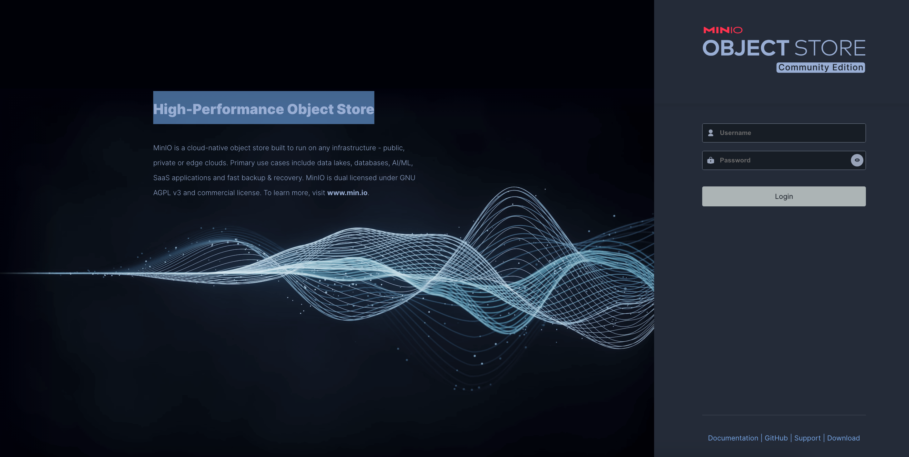

# Face Recognition System (Backend)

Readme Languages: <a href="./README_en.md">English 🇺🇸</a> / <a href="./README.md">繁體中文版 🇹🇼</a>


## 開發環境安裝

開始前，請先安裝 Python 3.10 版本、 uv 套件管理工具與 Docker 環境。

#### 下載 uv 環境管理工具

下載 uv tools (參考 [GitHub: astral/uv](https://github.com/astral-sh/uv))

```
pip install uv
```

透過 uv 與 pyproject.toml 建立虛擬環境
```
uv sync
```

#### 啟動 PostgreSQ、MinIO S3 與 Redis

#### MinIO S3

Pull Minio S3 image

```bash
docker pull quay.io/minio/minio:RELEASE.2025-07-23T15-54-02Z
```

建立 MinIO S3 本地靜態目錄

```bash
mkdir ./docker-volumes/minio
```

啟動 MinIO S3

```bash
docker run -d \
  --name facereco-minio \
  --restart always \
  -p 9000:9000 \
  -p 9001:9001 \
  -v $(pwd)/docker-volumes/minio/certs:/root/.minio/certs:ro \
  -v $(pwd)/docker-volumes/minio/cors.json:/root/.minio/config/cors.json \
  -v $(pwd)/docker-volumes/minio:/data \
  --network server_network \
  -e MINIO_ROOT_USER=<SET_USER_ACCOUNT> \
  -e MINIO_ROOT_PASSWORD=<SET_USER_PASSWORD> \
  -e MINIO_SERVER_URL="http://127.0.0.1:9000" \
  -e MINIO_BROWSER_REDIRECT_URL="http://127.0.0.1:9001" \
  quay.io/minio/minio server /data --console-address ":9001"
```

#### MinIO Web UI

成功啟動後，可以透過 `MINIO_BROWSER_REDIRECT_URL` 訪問 MinIO S3 Web，並透過設定的`MINIO_ROOT_USER` 與 `MINIO_ROOT_PASSWORD` 進行登入。




#### PostgreSQL

Pull PostgreSQL image

```bash
sudo docker pull postgres:16
```

建立靜態目錄

```bash
mkdir ./docker-volumes/postgres
```

啟動 PostgreSQL

```bash
docker run -d \
  --name facereco-postgres \
  --restart always \
  --network server_network \
  -e POSTGRES_USER=<SET_USER_ACCOUNT> \
  -e POSTGRES_PASSWORD=<SET_USER_PASSWORD> \
  -e POSTGRES_DB=facereco \
  -p 5432:5432 \
  -v $(pwd)/docker-volumes/postgre:/var/lib/postgresql/data \
  postgres:16
```

#### Redis

Pull redis image

```bash
pull redis:8.0.3
```

建立靜態目錄

```bash
./docker-volumes/redis
```

啟動 Redis

```bash
docker run -d \
  --name facereco-redis \
  --restart always \
  -p 6379:6379 \
  --network server_network \
  -v $(pwd)//docker-volumes/redis:/data \
  redis:8.0.3 \
  redis-server --appendonly yes --maxmemory 256mb --maxmemory-policy allkeys-lru
```

#### 後端系統參數配置

進入 ./backend 目錄，修改 `settings.toml` 設定檔，依照 MinIO 與 Postgres 啟動細節設定參數。

```toml
[postgres]
host= PostgreSQL IP
port = PostgreSQL Port
name = DB Name
user = user name
password = user password

[minios3]
enable_ssl = Enable SSL (SSL is not currently supported)
ca_path = CA Path
endpoint = MiniO S3 endpoint (IP:PORT)
external_endpoint = External endpoint (Used when deploying nginx, development mode is set to "")
access_key = user account
secret_key = user password
connect_timeout = Try to connect timeout (sec.)
read_timeout = S3 wait time for response (sec.)
total_timeout = Overall waiting time (including connection, request, and response)
max_retries = Number of failed reconnections (sec.)
backoff_factor = Retry interval (sec.)
pool_maxsize = Maximum number of connections
pool_block = Behavior when the connection pool is full (True: waiting / False: return fail)

[microservice]
endpoint = microservice endpoint
internal_token = Manually generated internal token

[tests]
test_server_url = server endpoint

[celery]
broker = redis broker endpoint
```

#### 啟動 Django

資料庫遷移與初始化設定

```bash
uv run python3 manage.py create_apps
uv run python3 manage.py create_user
uv run python3 manage.py create_retention
uv run python3 manage.py create_default_config
uv run python3 manage.py create_minio_buckets
```

啟動 Django server

```bash
uv run uvicorn app_server.asgi:application --host 0.0.0.0 --port 8000 --reload
```

#### 啟動 Celery

- Flower 啟動：
```bash
uv run celery -A app_server flower --port=5555
```

- Celery beat 啟動:
```bash
uv run celery -A app_server beat --loglevel=info
```

- Celery worker 啟動:
```bash
uv run celery -A app_server worker --loglevel=info
```

## Run Tests

設定 `settings.toml` 中 tests.test_server_url

```bash
uv run python3 run_test.py
```
